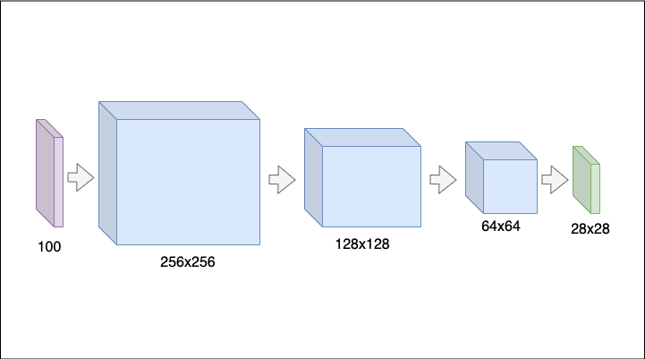

# draw-ai
The presented project is a demo of machine learning models usage 
which is implemented with the most popular frameworks like Tensorflow and PyTorch.

The project contains two type of models:
1) A classifier that is used to classify drawings.
2) An image generator to generate images from label.

[Open in Web (Heroku)](https://draw-ai-alexkbit.herokuapp.com)

## Dataset
I use [Quick Draw Dataset](https://github.com/googlecreativelab/quickdraw-dataset).

Quick Draw Dataset is a collection of 50 million drawings across 345 categories, contributed by players of the game Quick, Draw!.

## Classifier
Classification is the process of predicting the class of given data points.
Classes are sometimes called as targets/ labels or categories.
Classification predictive modeling is the task of approximating a mapping function from input variables to discrete output variables.

The classifier is a model implemented by the PyTorch framework. 
It is used to classify images either created by a user or those generated by the GAN generator.

Model Architecture:

## GAN (Generative adversarial network)
DCGAN - Deep Convolutional Generative Adversarial Network.
Generative Adversarial Networks (GANs) are one of the most interesting ideas in computer science today.
Two models are trained simultaneously by an adversarial process.
A generator ("the artist") learns to create images that look real, while a discriminator ("the art critic") learns to tell real images apart from fakes.

The solution uses a generator implemented by Tensorflow framework in order to generate images of required classes.

Model Architecture:

## Classifier vs GAN
We can compose these two models and use the GAN model results as input to improve classifier accuracy.

Look at how this process works on the UI.
[Open in Web](https://draw-ai-alexkbit.herokuapp.com/fight)

## Technologies
*  Python 
*  Tensorflow
*  PyTorch
*  Flask
*  Docker
*  Heroku

## Train & Build & Deploy
### Train jobs
Python model train jobs:
* `draw_classifier_train_job.py` - PyTorch classifier
* `draw_gan_train_job.py` - Tensorflow GAN

Notebooks:
* `notebooks/draw-classification.ipynb`
* `notebooks/draw-GAN.ipynb`

Models:
* `service/models/<label>-gan.h5` - Tensorflow GANs
* `service/models/model.nnet` - PyTorch classifier

### Build microservice
Run build script `service/buid.sh` - build docker image with service.
### Deploy
Run deploy script `service/deploy.sh` - deploy service to your Heroku application.

